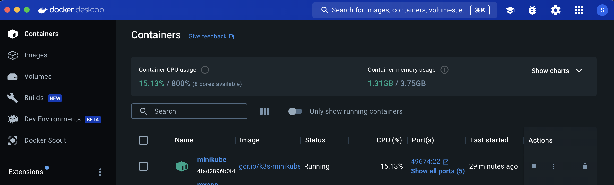
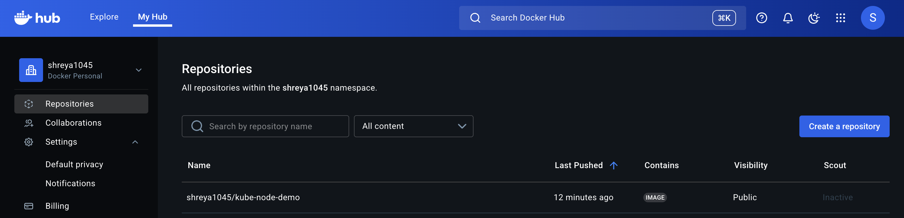
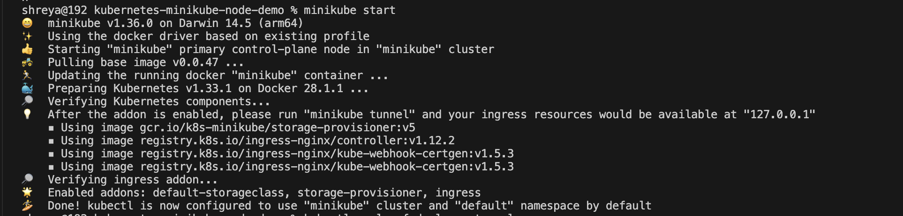
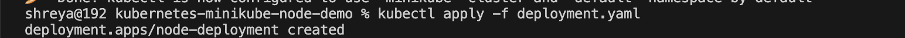
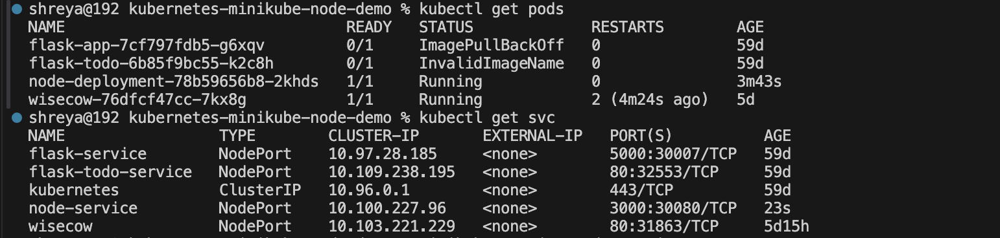
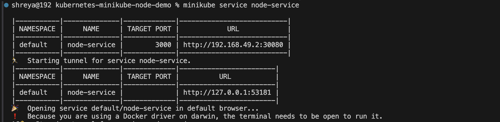
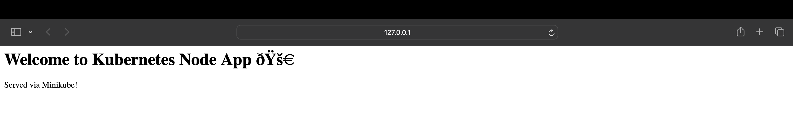
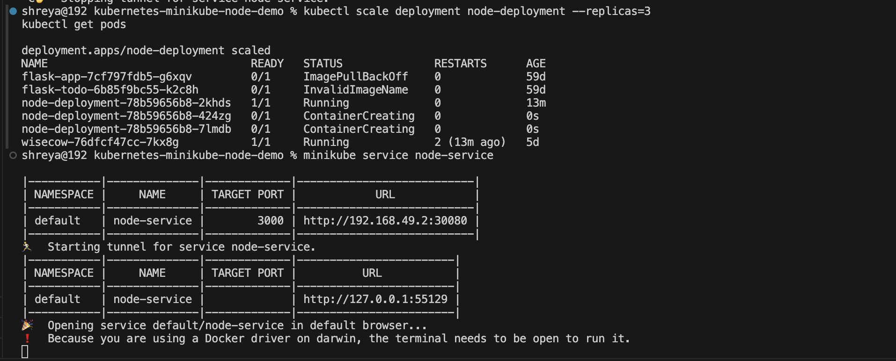

# 🚀 Kubernetes Minikube Node.js Deployment

This project demonstrates how to deploy a simple **Node.js web server** on a **Kubernetes cluster using Minikube**. It includes a Dockerized Node.js app, Kubernetes Deployment, and Service configuration.

---

## 📁 Project Structure
```
kubernetes-minikube-node-demo/
│── README.md
│── deployment.yaml
│── service.yaml
│── screenshots/ # (to be added manually)
│── src/
│ ├── Dockerfile
│ ├── package.json
│ └── server.js
```
---

## 🛠 Prerequisites

- ✅ Docker
- ✅ Minikube
- ✅ kubectl
- ✅ Git

---

## 🧱 1. Build & Push Docker Image

```bash
cd src
docker build -t kube-node-demo .
docker tag kube-node-demo <your-dockerhub-username>/kube-node-demo
docker push <your-dockerhub-username>/kube-node-demo
```


## 📦 2. Deploy to Kubernetes
```
minikube start
```

```
kubectl apply -f deployment.yaml
```

```
kubectl apply -f service.yaml
```

## Check status:
```
kubectl get pods
kubectl get svc
```

## 🌐 3. Access the App
```
minikube service node-service
```


## 📈 4. Scale the Deployment
```
kubectl scale deployment node-deployment --replicas=3
kubectl get pods
```

## Notes
We have a fully working Kubernetes deployment with a Node.js application running on Minikube. This demonstrates Dockerization, Kubernetes objects, scaling, and service exposure.
